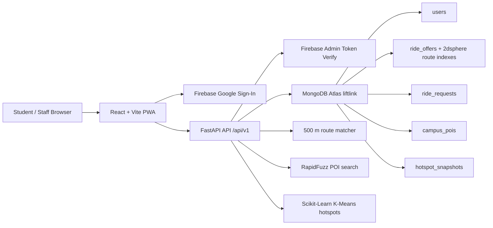

# LiftLink

AI-powered hyper-local campus ride-pooling for **Parul University** (`@paruluniversity.ac.in` only).

## Prerequisites

- **Node.js** 18+ and npm
- **Python** 3.11+
- **MongoDB Atlas** account (M0 free tier)
- **Firebase** project with Google Sign-In enabled

## Project Structure

```
LiftLink/
├── frontend/          # React + Vite + Tailwind + Leaflet (PWA)
├── backend/           # FastAPI + Motor + Firebase Admin
├── docs/              # Additional documentation
├── PRD.md             # Product requirements
└── ProjectBreakdown.md
```

## Architecture



Core rule of thumb: frontend handles interaction and map picking; backend owns trust boundaries, domain checks, GeoJSON validation, matching, booking state, and ML/NLP outputs.

## Quick Start

### 1. Clone and environment files

```bash
cp .env.example backend/.env
cp .env.example frontend/.env
```

Edit the copied files:

- `backend/.env`: keep backend variables only, especially `MONGODB_URI`, `FIREBASE_SERVICE_ACCOUNT_JSON`, `ALLOWED_EMAIL_DOMAIN`, `GEO_MATCH_RADIUS_METERS`, and `FUEL_SPLIT_RATE_PER_KM`.
- `frontend/.env`: keep frontend variables only, especially `VITE_API_BASE_URL` and the `VITE_FIREBASE_*` web app config.

### 2. MongoDB Atlas (manual — see `docs/SETUP_MONGODB.md`)

1. Create cluster `liftlink-dev` (M0).
2. Database user with read/write on database `liftlink`.
3. Network Access: allow your IP (dev: `0.0.0.0/0` is convenient but insecure).
4. Paste connection string into `backend/.env` as `MONGODB_URI`.

Test connection:

```bash
cd backend && python scripts/test_mongodb.py
```

After MongoDB is connected, create indexes and seed demo data:

```bash
cd backend
python scripts/init_indexes.py
python scripts/seed_pois.py
# After at least one Firebase user exists and one offer is present:
python scripts/seed_offers.py
python scripts/seed_requests_for_hotspots.py
```

### 3. Firebase (manual — see `docs/SETUP_FIREBASE.md`)

1. Create project, enable Google Sign-In.
2. Register web app → copy config to `frontend/.env` (`VITE_FIREBASE_*`).
3. Download service account JSON → `backend/firebase-service-account.json` (gitignored).

### 4. Backend

```bash
cd backend
python -m venv .venv
source .venv/bin/activate   # Windows: .venv\Scripts\activate
pip install -r requirements.txt
uvicorn app.main:app --reload --port 8000
```

- Health: http://localhost:8000/health
- API docs: http://localhost:8000/docs

### 5. Frontend

```bash
cd frontend
npm install
npm run dev
```

Open http://localhost:5173 — use **Check API Health** to verify backend + CORS.

## Demo Features

- Fuzzy campus search: typing aliases like `Uni Gate`, `Main Gate`, or `CBS` resolves to canonical POIs.
- Geospatial ride matching: rider pickup and dropoff must both be within 500 m of a driver's route.
- Trending pickup zones: run `POST /api/v1/hotspots/refresh` or use the dashboard refresh button after seeding accepted/completed requests.

## Demo Runbook

1. Start backend and frontend.
2. Sign in once as a driver so `/auth/sync` creates a MongoDB user.
3. Run `python scripts/init_indexes.py` and `python scripts/seed_pois.py`.
4. Create one offer from the UI, or run `python scripts/seed_offers.py`.
5. Sign in as a second Parul account and run the flow in [docs/DEMO_SCRIPT.md](./docs/DEMO_SCRIPT.md).
6. For hotspots, run `python scripts/seed_requests_for_hotspots.py`, then click **Refresh** under Trending Pickup Zones on the dashboard.

## Quality Checks

```bash
cd backend && source .venv/bin/activate && pytest
cd frontend && npm run lint
cd frontend && npm run build
```

## Environment Variables

See [`.env.example`](./.env.example) for the full list. Never commit `.env` or Firebase service account JSON.

## Development Status

Track progress in [`ProjectBreakdown.md`](./ProjectBreakdown.md).

## License

Academic minor project — Parul University, Semester 6.

## Team Members

- Ronitkumar Parmar
- Siddhesh Pandit
- Nikhil Raj 
- Dhirendra Nogiya
- 


